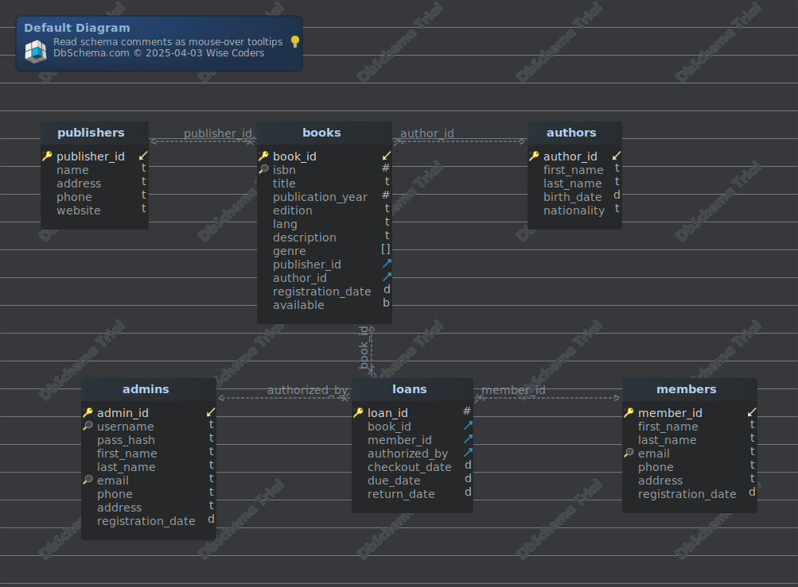

#Default Diagram
Generated using [DbSchema](https://dbschema.com)

### Default Diagram

## Tables

1. [library.admins](#table%20library.admins) 
2. [library.authors](#table%20library.authors) 
3. [library.books](#table%20library.books) 
4. [library.loans](#table%20library.loans) 
5. [library.members](#table%20library.members) 
6. [library.publishers](#table%20library.publishers) 

### Table library.admins 
Authorized people to confirm or reject loans requests.

|Idx |Name |Data Type |Description |
|---|---|---|---|
| * &#128273;  &#11019; | admin\_id| integer GENERATED BY DEFAULT AS IDENTITY (INCREMENT BY 1  )   | Unique identifier for the administrator. |
| &#128269; | username| varchar(100)  |  |
|  | pass\_hash| varchar(256)  |  |
|  | first\_name| varchar(100)  |  |
|  | last\_name| varchar(100)  |  |
| &#128269; | email| varchar  |  |
|  | phone| varchar(20)  |  |
|  | address| varchar  |  |
|  | registration\_date| date  |  |

### Table library.authors 
Tracks author details.

|Idx |Name |Data Type |Description |
|---|---|---|---|
| * &#128273;  &#11019; | author\_id| integer GENERATED BY DEFAULT AS IDENTITY (INCREMENT BY 1  )   | Unique identifier for the author. |
|  | first\_name| varchar(100)  | Author’s first name. |
|  | last\_name| varchar(100)  | Author’s last name. |
|  | birth\_date| date  | Date of birth (optional). |
|  | nationality| varchar(100)  | Author’s nationality (optional). |

### Table library.books 
Stores book metadata.

|Idx |Name |Data Type |Description |
|---|---|---|---|
| * &#128273;  &#11019; | book\_id| integer GENERATED BY DEFAULT AS IDENTITY (INCREMENT BY 1  )   | Unique identifier for the book. |
| &#128269; | isbn| bigint  | ISBN number (unique, nullable if unavailable). |
|  | title| varchar(255)  | Title of the book. |
|  | publication\_year| integer  DEFAULT 1900 | Year of publication. (higher than 1900) |
|  | edition| varchar  | Edition number (optional) |
|  | lang| varchar(100)  | Language of the book (e.g., "English"). |
|  | description| text  | Brief summary (optional). |
|  | genre| varchar[]  | Genre name (e.g., "Mystery"). |
| &#11016; | publisher\_id| integer  | Links to Publishers table. |
| &#11016; | author\_id| integer  | Links to Authors table. |
|  | registration\_date| date  | Date of book registration |
|  | available| boolean  | Availability to borrow the book. |

##### Foreign Keys
|Type |Name |On |Description |
|---|---|---|---|
|  | fk_authors | ( author\_id ) ref [library.authors](#authors) (author\_id) | Foreign key to Authors table |
|  | fk_publishers | ( publisher\_id ) ref [library.publishers](#publishers) (publisher\_id) | Foreign key to Publishers table |

##### Constraints
|Name |Definition |Description |
|---|---|---|
| check_pub_year | publication\_year &gt; 1900 |

### Table library.loans 
|Idx |Name |Data Type |Description |
|---|---|---|---|
| * &#128273;  | loan\_id| integer GENERATED BY DEFAULT AS IDENTITY (INCREMENT BY 1  )   |  |
| &#11016; | book\_id| integer  | Book's ID. |
| &#11016; | member\_id| integer  | Borrower’s ID. |
| &#11016; | authorized\_by| integer  | Admin’s ID. |
|  | checkout\_date| date  | Date the book was borrowed. |
|  | due\_date| date  | Expected return date. |
|  | return\_date| date  | Actual return date (nullable if not yet returned). |

##### Foreign Keys
|Type |Name |On |
|---|---|---|
|  | fk_member_id_loans | ( member\_id ) ref [library.members](#members) (member\_id) |
|  | fk_authorized_by_loans | ( authorized\_by ) ref [library.admins](#admins) (admin\_id) |
|  | fk_loans_books | ( book\_id ) ref [library.books](#books) (book\_id) |

### Table library.members 
Stores library member details.

|Idx |Name |Data Type |Description |
|---|---|---|---|
| * &#128273;  &#11019; | member\_id| integer GENERATED BY DEFAULT AS IDENTITY (INCREMENT BY 1  )   | Unique identifier for the member. |
|  | first\_name| varchar(100)  | Member’s first name. |
|  | last\_name| varchar(100)  | Member’s last name. |
| &#128269; | email| varchar  | Unique email address. |
|  | phone| varchar(20)  | Contact number. |
|  | address| varchar  | Member’s address. |
|  | registration\_date| date  | Date of membership registration. |

### Table library.publishers 
|Idx |Name |Data Type |Description |
|---|---|---|---|
| * &#128273;  &#11019; | publisher\_id| integer GENERATED BY DEFAULT AS IDENTITY (INCREMENT BY 1  )   | Unique identifier for the publisher. |
|  | name| varchar(100)  | Publisher’s name. |
|  | address| varchar(255)  | Publisher’s address (optional). |
|  | phone| varchar(20)  | Contact number (optional). |
|  | website| varchar  | URL (optional) |

